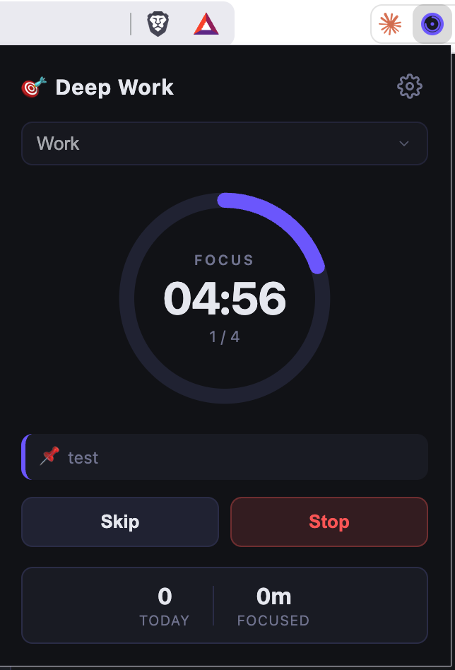
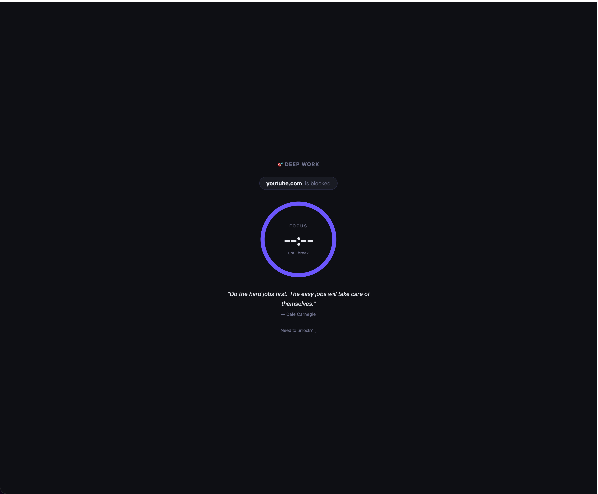
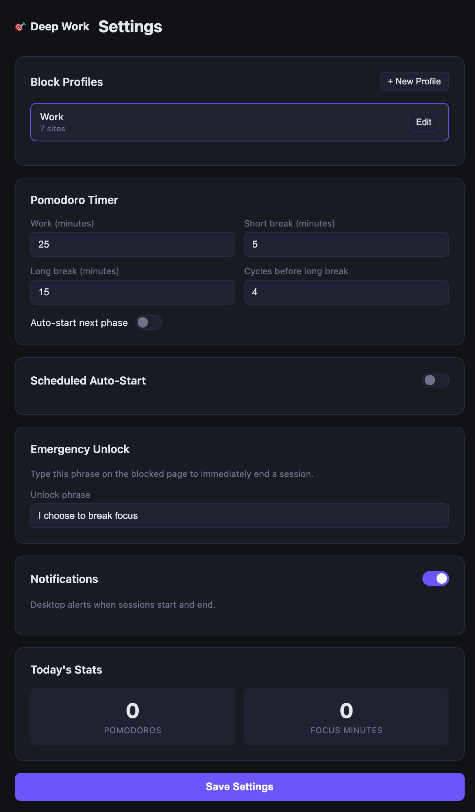

# Deep Work Extension

A Chrome extension that helps you stay focused using the Pomodoro Technique — it blocks distracting websites during work sessions and tracks your daily focus stats.

---

## Screenshots

| Popup (Work Session) | Blocked Page |
|---|---|
| |  |

| Settings — Block Profiles | Settings — Pomodoro Config |
|---|---|
|  |  |
---

## Features

### Pomodoro Timer
- 25-minute work sessions followed by 5-minute short breaks
- Long break (15 min) after every 4 completed cycles
- Live countdown visible in the popup
- Optional auto-start for the next phase
- Skip current phase at any time

### Website Blocking
- **Block mode** (default): blocks a list of specified domains and redirects them to a custom "Stay Focused" page
- **Whitelist mode**: blocks all sites except a specified allow-list — useful for strict focus sessions
- Blocking is active only during work phases; breaks are unrestricted

### Block Profiles
- Create multiple named profiles (e.g., "Work", "Study", "Reading")
- Each profile has its own site list and block/whitelist mode
- Switch profiles from the Settings page; changes take effect on the next session

### Blocked Page
- Shows a motivational message and the time remaining in the current work session
- Displays the site you tried to visit
- **Emergency Unlock**: type your configured phrase to bypass blocking for the rest of the session (default phrase: `I choose to break focus`)

### Settings
- Customise work, short break, and long break durations
- Set the number of cycles before a long break
- Enable/disable desktop notifications for phase transitions
- Configure a weekly schedule — the extension auto-starts sessions on selected days at a set time
- Change your emergency unlock phrase

### Stats
- Tracks completed Pomodoros and total focus minutes per day
- Retains the last 30 days of history
- Visible in the popup footer

### Session Persistence
- Active sessions survive browser restarts — the timer and blocking rules are restored automatically when the browser re-opens

---

## Installation

```bash
# 1. Clone the repo
git clone <repo-url>
cd deep-work-extension

# 2. Install dependencies
npm install

# 3. Build the extension
npm run build
```

Then load it in Chrome:

1. Open `chrome://extensions`
2. Enable **Developer mode** (top-right toggle)
3. Click **Load unpacked** and select the `dist/` folder

> After any code change, run `npm run build` again and click the reload icon on the extension card in `chrome://extensions`.

### Dev mode (hot-reload)

```bash
npm run dev
```

Vite watches for changes and rebuilds automatically. You still need to reload the extension in Chrome to pick up service-worker changes.

---

## Usage

### Starting a session

1. Click the extension icon to open the popup.
2. (Optional) Enter a task label in the text field.
3. Click **Start** — the 25-minute work timer begins and your block list becomes active.

### During a session

- The popup shows the current phase (Work / Short Break / Long Break), remaining time, and today's completed Pomodoro count.
- Blocked sites redirect to the **Stay Focused** page with a live countdown.
- Click **Stop** to end the session early (removes all blocking rules).
- Click **Skip** to jump to the next phase immediately.

### Emergency unlock

If you genuinely need access to a blocked site mid-session:

1. Navigate to the blocked page for that site.
2. Click **Emergency Unlock**.
3. Type your unlock phrase exactly (default: `I choose to break focus`).
4. Blocking is suspended for the rest of the current work phase.

### Configuring block profiles

1. Click **Settings** (gear icon in the popup).
2. Under **Block Profiles**, click **New Profile** to create one or edit an existing profile.
3. Add domains line-by-line (e.g. `reddit.com`, `twitter.com`).
4. Toggle **Whitelist Mode** if you want to allow only the listed sites instead of blocking them.
5. Select the profile you want active using the dropdown at the top of Settings.

### Scheduling sessions

1. In Settings, scroll to **Schedule**.
2. Enable the schedule toggle.
3. Pick the days of the week and a start time (24h format).
4. Save — the extension will auto-start a work session at that time on selected days, even if the popup is closed.

---

## Project Structure

```
src/
├── background/
│   ├── service-worker.ts   # State machine, alarms, message hub
│   └── blocker.ts          # declarativeNetRequest rule management
├── popup/
│   ├── popup.html
│   └── popup.ts
├── settings/
│   ├── settings.html
│   └── settings.ts
├── blocked/
│   ├── blocked.html
│   └── blocked.ts
└── shared/
    ├── types.ts            # All TypeScript interfaces
    ├── constants.ts        # Defaults, alarm names, storage keys
    ├── storage.ts          # Typed chrome.storage wrappers
    └── quotes.json         # Motivational quotes for the blocked page
screenshots/                # Drop your UI screenshots here
public/icons/               # Extension icons (16/48/128 px)
```

---

## Pomodoro Cycle

```
IDLE → WORK (25 min) → SHORT BREAK (5 min) → WORK → ...
                                     ↓ (after 4 cycles)
                              LONG BREAK (15 min) → WORK → IDLE
```

---

## Default Block List

The built-in "Work" profile blocks:

- twitter.com / x.com
- reddit.com
- instagram.com
- facebook.com
- youtube.com
- tiktok.com

You can edit or replace this list in Settings at any time.

---

## Tech Stack

- **TypeScript** + **Vite** — build tooling
- **vite-plugin-web-extension** — MV3 manifest bundling
- **Chrome APIs**: `chrome.alarms`, `chrome.declarativeNetRequest`, `chrome.storage.local`, `chrome.notifications`
